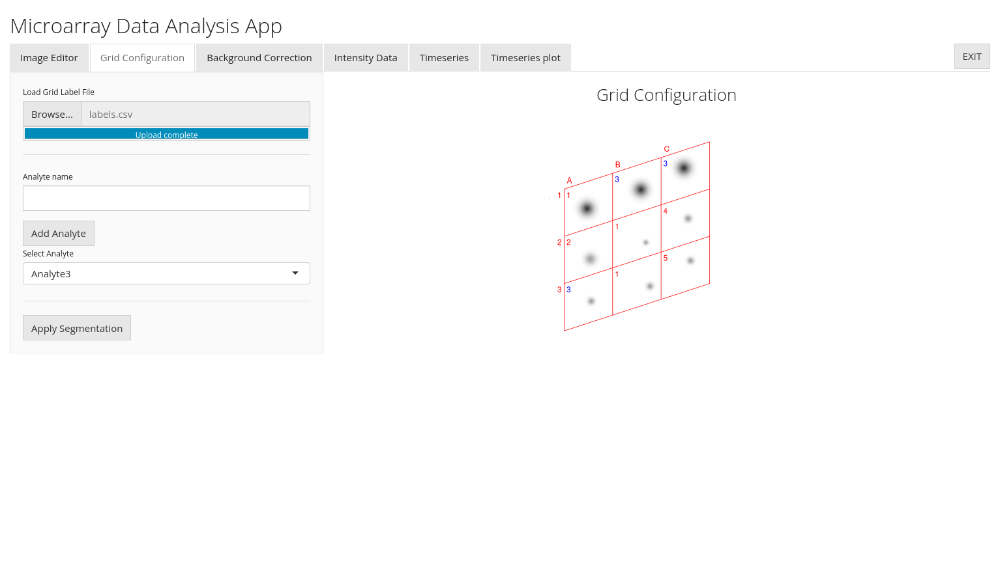

# MADApp
The repository includes the development version of shiny application MADApp

[](https://www.gnu.org/licenses/lgpl-3.0)
[](https://www.repostatus.org/#wip)

## Testing version of the app (shinyapps.io)

Our app can be tested on shinyapps.io. 

https://lfapp.shinyapps.io/madapp/


## Installation

MADApp is dependent on following packages

- shiny
- shinyjs
- shinythemes
- fs
- DT
- tidyr
- plotly
- colourpicker
- EBImage

They can be installed via
```
install.packages(c("shiny","shinyjs","shinythemes","fs","DT","tidyr","plotly","colourpicker"))
```

Additionaly, the application requires EBImage package which can not be found on CRAN and should be installed from Bioconductor via
```{r, eval = FALSE}
## Install package BiocManager
if(!require(BiocManager)) install.packages("BiocManager")
## Use BiocManager to install EBImage
BiocManager::install("EBImage", update = FALSE)
```

## Start App
The application can be loaded into RStudio and started with Run App command; or from R with the following commands

```{r}
library(shiny)
runApp("R/MADApp.R")
```

## Description
Image analysis (cropping, segmentation, thresholding, feature engineering, plotting, timeseries) of images taken from microarrays.

## Preview





